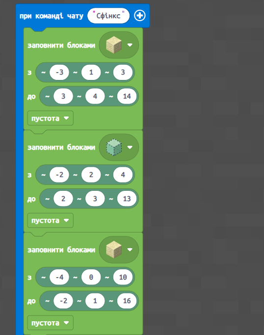
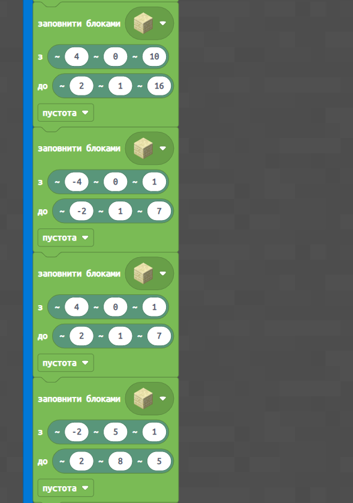
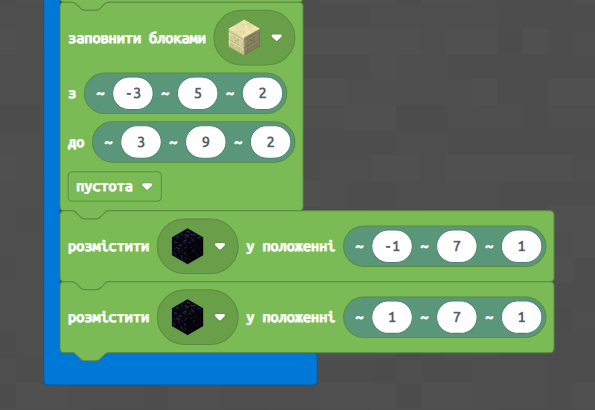
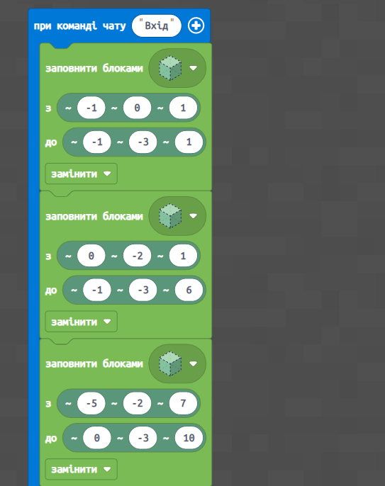
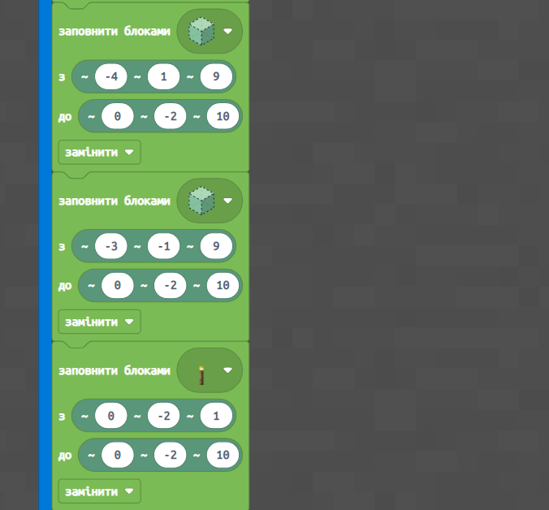
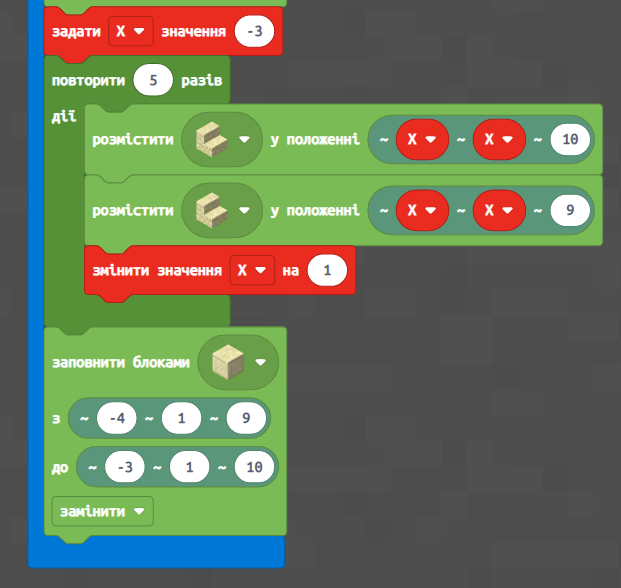

# Єгипетський Сфінкс

#### Опис


На цьому занятті ми відпрацюємо найважливішу для будівництва різних об'єктів навичку — використання абсолютних координат.


## Згадаймо🤔

1. Як створити колону, чергуючи різні блоки?&#x20;
2. Що таке цикл?&#x20;
3. Що таке параметр?&#x20;
4. Що таке відносні координати?

## **Перевірка знань за перші 4 заняття**

### **Завдання 1**

**Написати такий код:**

* Агент телепортується до Гравця,&#x20;
* і робить вперед **4 кроки**,&#x20;
* тоді Агент будує квадрат із скла **5х5 блоки**&#x20;
* тоді він стає посередині квадрату і піднімається вгору на **3 блоки** і тоді виливає воду, яка має потрапити у скляний квадрат

### **Завдання 2**

**Написати такий код:**

За допомогою координат створіть доріжку із блоків Колії довжиною 8 блоків

Переходь далі, якщо впорався із завданням

## **Можлива відповідь**

## Сьогодні ми:

1. Згадаємо, що таке відносні координати і дізнаємось, чим вони відрізняються від абсолютних координат.&#x20;
2. Побудуємо лінію блоків в абсолютних координатах.&#x20;
3. Побудуємо куби порожні всередині, які можуть стати майбутнім будинком.

> **Усі ці навички обов'язково знадобляться під час виконання вашого проєкту!**😉

## [**Єгипетський Сфінкс**](https://makecode.com/\_2YhXtc1ys44b)


**Сфінкс** — у давньоєгипетському мистецтві — тварина з тілом лева, головою людини або — головою сокола або барана. Єгипетських фараонів було прийнято зображати у вигляді грізного лева, який не пощадить жодного ворога. Саме тому вважається, що **Сфінкс охороняє спокій похованих фараонів**


| **Завдання**  | Побудувати сфінксу                                                                                                                                                                                                                     |
| ------------- | -------------------------------------------------------------------------------------------------------------------------------------------------------------------------------------------------------------------------------------- |
| **Код**       | 
  
                                                                                                |
| **Результат** |  |

## [**Таємний вхід до Сфінксу**](https://makecode.com/\_LMTbv3Kqo16K)


Дослідники виявили під передніми лапами Сфінкса хитро замасковану потайну камеру, де був вхід у вузький тунель. Усередині сфінкс може мати три тунелі, призначення яких за давністю років незрозуміле.

Існує легенда, що розповідає, що цей величезний хижак вічно пильнує, охороняючи спокій пірамід. Вночі він бачить краще, ніж удень. В іншому міфі Сфінксу довірено стежити за сходом Сонця та зверненням планет 🌞


| **Завдання** | 

Побудувати таємний вхід до Сфінксу
                                                                                        |
| ------------ | --------------------------------------------------------------------------------------------------------------------------------------- |
| **Код**      | 
  
 |


На наступному занятті продовжимо подорож Стародавнім світом, відпрацювання розуміння абсолютних координат! Також ви отримаєте навички, які знадобляться для вашого проєкту😉

