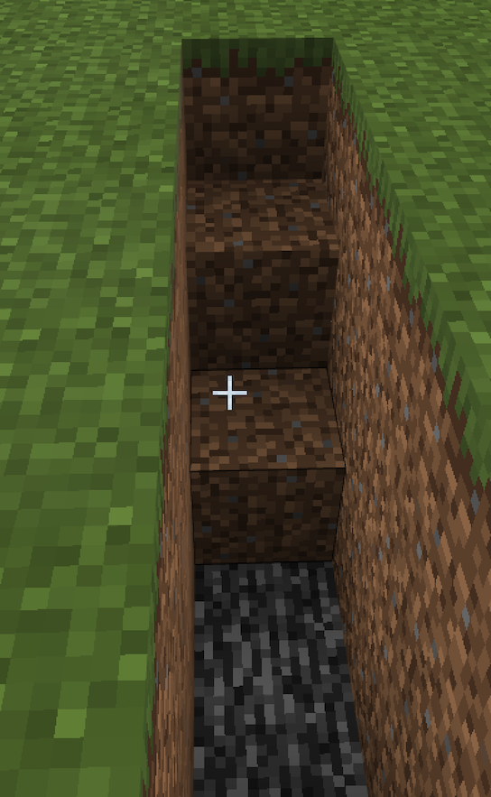
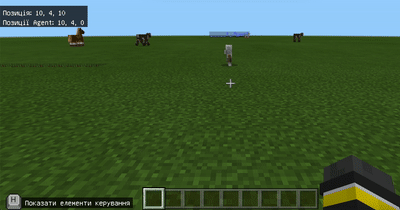
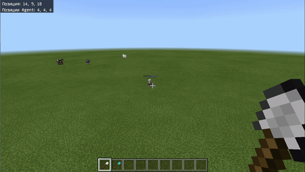

# Єгипетський Сфінкс

#### Опис


На цьому занятті ми відпрацюємо найважливішу для будівництва різних об'єктів навичку — використання абсолютних координат.


## Згадаймо🤔

1. Як створити колону, чергуючи різні блоки?&#x20;
2. Що таке цикл?&#x20;
3. Що таке параметр?&#x20;
4. Що таке відносні координати?

## **Перевірка знань за перші 4 заняття**

### **Завдання 1**

**Написати такий код:**

* Агент телепортується до Гравця,&#x20;
* і робить вперед **4 кроки**,&#x20;
* тоді Агент будує квадрат із скла **5х5 блоки**&#x20;
* тоді він стає посередині квадрату і піднімається вгору на **3 блоки** і тоді виливає воду, яка має потрапити у скляний квадрат

### **Завдання 2**

**Написати такий код:**

За допомогою координат створіть доріжку із блоків Колії довжиною 8 блоків

Переходь далі, якщо впорався із завданням

## **Можлива відповідь**

## Сьогодні ми:

1. Згадаємо, що таке відносні координати і дізнаємось, чим вони відрізняються від абсолютних координат.&#x20;
2. Побудуємо лінію блоків в абсолютних координатах.&#x20;
3. Побудуємо куби порожні всередині, які можуть стати майбутнім будинком.

> **Усі ці навички обов'язково знадобляться під час виконання вашого проєкту!**😉

## ****[**Єгипетський Сфінкс**](https://makecode.com/\_AA1Wz7RhoMKY)****


**Сфінкс** — у давньоєгипетському мистецтві — тварина з тілом лева, головою людини або — головою сокола або барана. Єгипетських фараонів було прийнято зображати у вигляді грізного лева, який не пощадить жодного ворога. Саме тому вважається, що **Сфінкс охороняє спокій похованих фараонів**


| **Завдання**  | Побудувати сфінксу                                                                                                                                                                                                                                                                                                                                                                                                                                                                                                                                                                                                                                                                                               |
| ------------- | ---------------------------------------------------------------------------------------------------------------------------------------------------------------------------------------------------------------------------------------------------------------------------------------------------------------------------------------------------------------------------------------------------------------------------------------------------------------------------------------------------------------------------------------------------------------------------------------------------------------------------------------------------------------------------------------------------------------- |
| **Код**       |  |
| **Результат** |                                                                                                                                                                                                                                                                                                                                                                                                                                                                            |

## ****[**Таємний вхід до Сфінксу**](https://makecode.com/\_LMTbv3Kqo16K)****


Дослідники виявили під передніми лапами Сфінкса хитро замасковану потайну камеру, де був вхід у вузький тунель. Усередині сфінкс може мати три тунелі, призначення яких за давністю років незрозуміле.

Існує легенда, що розповідає, що цей величезний хижак вічно пильнує, охороняючи спокій пірамід. Вночі він бачить краще, ніж удень. В іншому міфі Сфінксу довірено стежити за сходом Сонця та зверненням планет **** 🌞


| **Завдання** | 

Побудувати таємний вхід до Сфінксу
                                                                                                                                                                                                                                                                                                                                                                                                                                                                                                                                                                                                                                                                   |
| ------------ | ------------------------------------------------------------------------------------------------------------------------------------------------------------------------------------------------------------------------------------------------------------------------------------------------------------------------------------------------------------------------------------------------------------------------------------------------------------------------------------------------------------------------------------------------------------------------------------------------------------------------------------------------------------------------------------------------------------------ |
| **Код**      |  |

## Теорія (додаткове)

Згадаймо основні поняття:


**Координати** — сукупність значень, що утворює систему **координат**, призначену для визначення місця розташування об'єктів в ігровому світі.

**Система координат** — спосіб визначати положення та переміщення точки чи тіла за допомогою чисел чи інших символів.

**Відносні координати** — прив'язані до гравця (відносно гравця), а не до світу.


Для того, щоб будувати складні будинки у певній точці світу, нам потрібно працювати з **абсолютними координатами**.


**Абсолютні координати** — прив'язані до світу, а не до гравця.


Щоб користуватися координатами, треба їх увімкнути. Способи включення координат:

1\) Включити відображення координат під час створення світу:

.png>)

2\) Включити відображення координат після створення світу:

.png>).png>)

Під час запуску світу гравець з'явиться у точці з координатою (0; 4; 0). Це означає, що по ширині та довжині у світі ми знаходимося в центрі (перша та третя цифра, які дорівнюють 0). А висота (друга цифра) — 4. Тому що під ногами є 3 блоки землі та 1 бедрока.

## Основні завдання


Ми з вами, як і раніше, знаходимося в Стародавньому світі. Але за всіх часів важливою складовою життя був будинок. Сьогодні ми з вами навчимося робити основу будь-якої будівлі – куб порожній всередині.


| **№**         | **1**                                                                                                                                                                                                                                                                                             |
| ------------- | ------------------------------------------------------------------------------------------------------------------------------------------------------------------------------------------------------------------------------------------------------------------------------------------------- |
| **Завдання**  | <ol><li>Перемістіться в точку <strong>(0;1;0)</strong></li><li>Перемістіться в точку <strong>(10;4;0)</strong></li><li>Перемістіться в точку <strong>(10;4;10)</strong></li><li>Перемістіться в точку <strong>(-5;4;5)</strong></li><li>Перемістіться в точку <strong>(0;10;0)</strong></li></ol> |
| **Код**       | Перейти з урахуванням координат                                                                                                                                                                                                                                                                   |
| **Результат** | .png>)                                                                                                                                                                                                                                                             |

## Переміщення агента в точку

Вам вже відомо, як переміщувати агента. За допомогою команди **«Агент — телепортуватися до гравця»** ви можете "покликати" агента до себе і він переміститься в ту ж точку, у якій знаходиться гравець.

&#x20;.png>).png>)

| **№**         | **2**                                                                                                                                                                                                                                                                                                                      |
| ------------- | -------------------------------------------------------------------------------------------------------------------------------------------------------------------------------------------------------------------------------------------------------------------------------------------------------------------------- |
| **Завдання**  | <ol><li>Перемістіть агента в точку <strong>(0;1;0)</strong></li><li>Перемістіть агента в точку <strong>(10;4;0)</strong></li><li>Перемістіть агента в точку <strong>(10;4;10)</strong></li><li>Перемістіть агента в точку <strong>(-5;4;5)</strong></li><li>Перемістіть агента в точку <strong>(0;10;0)</strong></li></ol> |
| **Код**       | Перейти з урахуванням координат                                                                                                                                                                                                                                                                                            |
| **Результат** | .png>)                                                                                                                                                                                                                                                                                      |

## Прокладання ліній за координтами

Потренуємо розуміння абсолютних координат.

За допомогою команди **«Блоки»** можна програмувати прокладання блоків між певними координатами.

Наприклад, прокладемо блоки від точки **(10; 4; 0)** до точки **(10; 4; 10)**. Для цього в розділі «Блоки» візьмемо блок **«Заповнити блоками з до»** і додамо всередину блоку «При команді чату `l`».

.png>)

Замінимо тип блоків на «**Дошки з дубової деревини**».

.png>)

У розділі **«Позиції»** візьмемо блоки з вказівником **«світ»** — **саме за допомогою цих блоків можна задавати абсолютні координати.**

.png>)

І проставимо відповідні значення

.png>)

У результаті — тримаємо лінію з блоків дубової деревини в абсолютних координатах

.gif>)

### А тепер закріпимо!

| **№**         | **3**                                                                                                                                                                                                                                                                                                                                                                                                 |
| ------------- | ----------------------------------------------------------------------------------------------------------------------------------------------------------------------------------------------------------------------------------------------------------------------------------------------------------------------------------------------------------------------------------------------------- |
| **Завдання**  | <ol><li>Прокладіть блоки з точки <strong>(10;4;0)</strong> до точки <strong>(10;4;10)</strong></li><li>Прокладіть блоки з точки <strong>(10;4;10)</strong> до точки <strong>(10;4;20)</strong></li><li>Прокладіть блоки з точки <strong>(10;4;20)</strong> до точки <strong>(0;4;20)</strong></li><li>Прокладіть блоки з точки <strong>(5;4;10)</strong> до точки <strong>(5;4;20)</strong></li></ol> |
| **Код**       | .png>)                                                                                                                                                                                                                                                                                                                                                                 |
| **Результат** |                                                                                                                                                                                                                                                                                                                                                                       |

## Використання агента для позначення координат

Для того, щоб зорієнтуватися у світі, використовуються **координати гравця**. Також гравець бачить **координати агента**, якщо знаходиться на відстані меншій за 80 блоків по одному з вимірювань.&#x20;

Те, що гравець бачить координати агента, зручно використовувати для будування кубів з блоків. В одній точці ставиться агент, в іншу переміщається гравець. Ці координати переписуються в команду, яка заповнює блоками простір між заданими точками.

.png>)

### Визначення координат для куба з дерева

Для того, щоб визначити координати створюваного нами куба з дерева поставимо в нижню точку агента, а самі перелетимо в точку, в якій куб повинен закінчуватися.&#x20;

Далі, використання певного предмета (у разі — це залізна лопата), поставимо заповнення блоками з координат, у яких перебуває гравець у координати, у яких перебуває агент.

.png>)

Для того, щоб заповнити цей простір блоками використовуємо залізну лопату

.png>)

## Порожній куб

Для того, щоб усередині куба був порожній простір необхідно у списку вибрати пункт **«пустота»**

.png>)

При такому блоці у нас всередині блоку буде нижня частина куба **на 1 блок** вище за рівень трави.

.png>)

## Порожній куб рівня підлоги

Для того щоб нижня частина куба була в рівень землі, необхідно поставити значення y на 1 нижче ніж стоїть агент.

.png>).png>)

## Додаткові завдання

### Розрахунки ширини та висоти

Знаючи координати точок відліку, ми можемо обчислити **розміри** тієї фігури, яка в нас вийде.&#x20;

У Minecraft є 3 координати, вони йдуть послідовно: **x, y, z**&#x20;

Якщо координати першої точки відзначити **x1, y1, z1**, а координати другої точки відповідно **x2, y2, z2** то:&#x20;

висота (h) цієї фігури дорівнюватиме **h = y2 - y1**&#x20;

довжина (l) дорівнює **l = x2 - x1**&#x20;

ширина (b) дорівнює **b = z2 - z1**

.png>)

В наведеному прикладі:

* **Висота**: h = y2 - y1 = 9 - 4 **= 5**
* **Довжина**: l = x2 - x1 = 14 - 4 **= 10**
* **Ширина**: b = z2 - z1 = 18 - 4 **= 14**

Ми створили фігуру висотою **5 блоків,** довжиною **10** та шириною **14** блоків. Якщо висота, ширина і довжина рівні між собою, то така фігура — **куб**. У решті випадків — **паралелепіпед**.

### Створення блоків за розмірами

| **Завдання**  | <ol><li>Створіть куб розміром <strong>10х10х10</strong> із дощечок дуба з позицією нижнього краю куба на рівні землі. </li><li>Створіть куб розміром <strong>5х5х5</strong> із дощечок дуба з позицією нижнього краю куба на рівні землі.  </li><li>Створіть паралелепіпед розміром 5<strong>х20х10</strong> із дощечок дуба з позицією нижнього краю куба на рівні землі. </li></ol> |
| ------------- | ------------------------------------------------------------------------------------------------------------------------------------------------------------------------------------------------------------------------------------------------------------------------------------------------------------------------------------------------------------------------------------- |
| **Код**       | .png>)                                                                                                                                                                                                                                                                                                                                                 |
| **Результат** | .png>)                                                                                                                                                                                                                                                                                                                                                 |

### Внутрішній простір

Створений у попередньому блоці паралелепіпед можна використовувати для створення **власного будинку.**&#x20;

Але через те, що він повністю заповнений, зробити це буде складно. Щоб його можна використовувати, внутрішню частину заповнимо повітрям, залишивши по 1 блоку на стіни.&#x20;

Розрахуємо координати вкладеного паралелепіпеда з повітря:

* x3 = x1 + 1
* y3 = y
* z3 = z1 + 1
* x4 = z2 - 1
* y4 = y2 - 1
* z4 = z2 - 1

> **y3 = y1**, так як підлогу ми залишаємо з того ж матеріалу, що і був до встановлення блоків.

.png>)

### Куб порожній всередині

Куб із дощечок (або іншого матеріалу) є гарною основою для будівель, у тому числі і для будинку. Але для будинку гарним є не суцільний блок, а блок, в якому є порожнеча (повітря).

.png>).png>)

[https://makecode.com/\_CiU5jLacYf0r](https://makecode.com/\_CiU5jLacYf0r)

## Творче завдання

1. Зробити заготовку для **будинку із цегли**. Оформити внутрішнє оздоблення будинку за бажанням.
2. Зробити **двір** для будинку, у якому створити **сад** (з квітів на ваш вибір) та провести доріжку до будинку.
3. `*` Зробити **прибудову** до будинку (має бути нижче і менше) з товщиною стін у 2 блоки.
4. `*` Зробити льох (виїмка в землі, що закривається люком), що знаходиться за будинком.
5. `**` Поставити будинок, який одним краєм стосується координат (1,0,1) має ширину 16 блоків, довжину 14 блоків і висоту 15 блоків

## Домашнє завдання

### Завдання 1

Побудувати лінії з кактусів біля Сфінксу&#x20;

### Завдання 2

Доповніть код будинку Сфінксу [https://makecode.com/\_LMTbv3Kqo16K](https://makecode.com/\_LMTbv3Kqo16K) , щоб всередині нього з'явилося освітлення&#x20;

### Завдання 3 (додаткове)&#x20;

Всередині Сфінксу розмістіть вручну картини, меблі, вазон із квіткою. А зовні будинку розмістіть прапор Єгипту


На наступному занятті продовжимо подорож Стародавнім світом, відпрацювання розуміння абсолютних координат! Також ви отримаєте навички, які знадобляться для вашого проєкту😉

